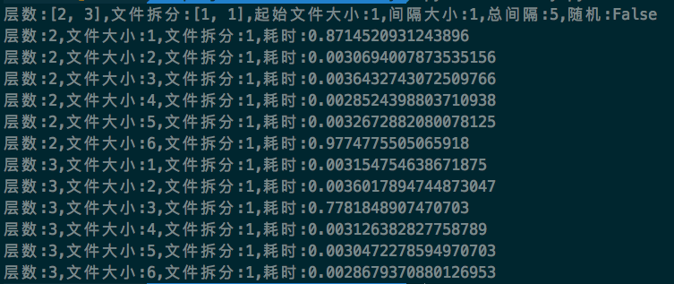
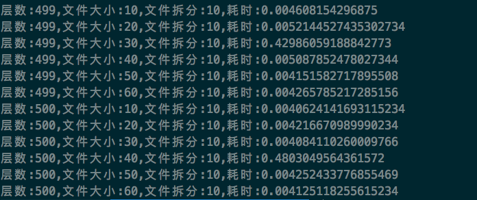
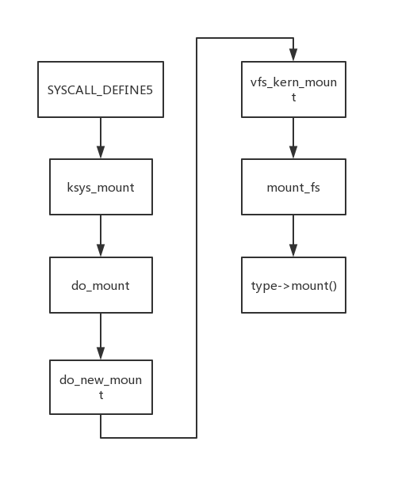
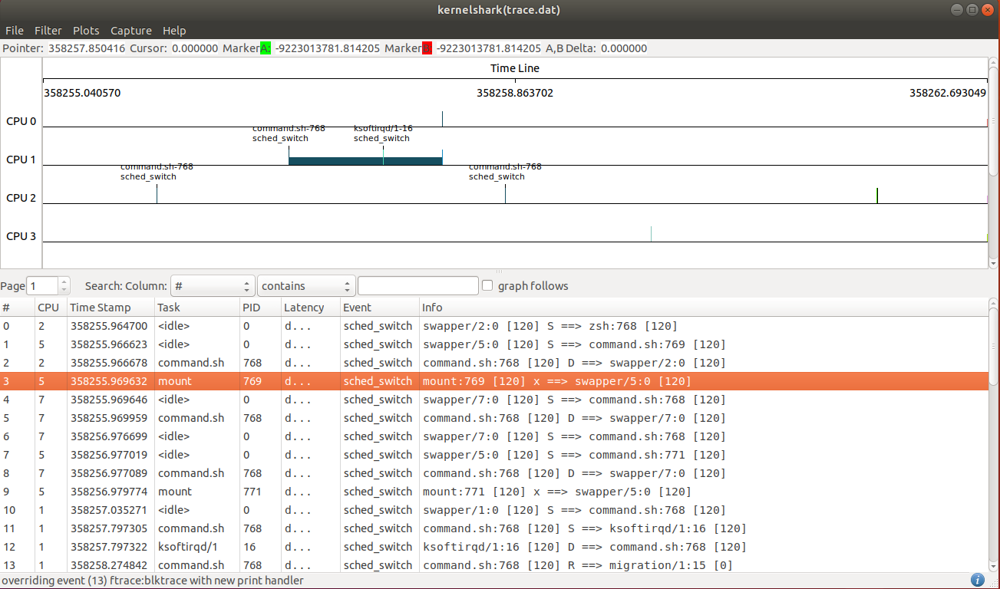
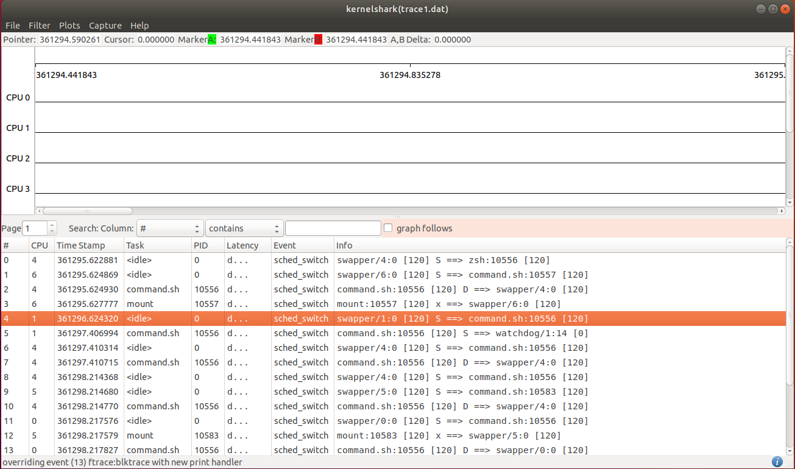

# Analysis of the running time of "mount"

## 介绍
&emsp;&emsp;本文结合linux实现代码对overlay文件系统的挂载进行分析，同时本文使用trace-cmd以及kernelshark分析工具对mount指令在linux系统中的调用以及执行过程进行分析，以求还原其调用过程从而得到更加准确的指令执行时间。同时本文所使用的分析方法也适用于对linux系统上的进程调用进行分析。

## 背景
&emsp;&emsp;使用脚本`overlay.py`对overlay文件系统在linux系统下的挂载时间进行分析可以看到lowerdir的个数以及其中的文件数量或者文件大小对该文件系统的挂载时间影响甚微。



&emsp;&emsp;上图中的层数代表lowerdir的数量，文件大小单位是MB，表示每一个lowerdir中文件的总大小，拆分即对文件进行分割，随机表示是否使用随机生成的文件序号，这样upper不至于将所有lower文件覆盖，首先我们不讨论其中比较异常的耗时，可以看到平均的挂载时间在3ms左右。



&emsp;&emsp;我们使用更高的参数值来运行测试，将lowerdir的层数增大到499至500层，每一层的文件大小为10MB至60MB，同时将其拆分为10个单独的文件，可以看到挂载时间会有少许提高，大概达到了4ms左右。

## 挂载参数对挂载时间的影响
&emsp;&emsp;想要彻底了解overlay文件系统的挂载时间究竟受到哪些参数的影响需要对linux内核中overlay文件系统的实现进行分析，下面简单分析一下overlay文件系统的挂载过程，分析使用的源码在[这里](https://code.woboq.org/linux/linux/fs/namespace.c.html)。当然，想要查看最新的源码可以点[这里](https://github.com/torvalds/linux),最新的源码对文件系统部分做了很多改动，因此函数调用会有变化，但不影响我们对overlayfs的分析。
&emsp;&emsp;Linux kernel通过系统调用的方式为用户提供陷入到内核，mount的系统调用是SYSCALL_DEFINE5，位于fs/namespace.c，对于新挂载的文件系统，之后的调用关系可以使用下图说明：



&emsp;&emsp;可以看到mount指令最终执行到的是具体文件系统在注册时注册的mount函数，对于overlayfs而言，它的mount函数位于linux/fs/overlayfs/super.c:
```C
static struct dentry *ovl_mount(struct file_system_type *fs_type, int flags,
				const char *dev_name, void *raw_data)
{
	return mount_nodev(fs_type, flags, raw_data, ovl_fill_super);
}
static struct file_system_type ovl_fs_type = {
	.owner		= THIS_MODULE,
	.name		= "overlay",
	.mount		= ovl_mount,
	.kill_sb	= kill_anon_super,
};
```
而在`ovl_mount`中调用的`mount_nodev`最终会使用传入的`ovl_fill_super`函数指针，`ovl_fill_super`函数用于填充overlayfs文件系统的super block结构，同时用于构建overlayfs文件系统的ovl_fs结构体：
```C
struct ovl_fs {
	struct vfsmount *upper_mnt;
	unsigned int numlower;
	/* Number of unique lower sb that differ from upper sb */
	unsigned int numlowerfs;
	struct ovl_layer *lower_layers;
	struct ovl_sb *lower_fs;
	/* workbasedir is the path at workdir= mount option */
	struct dentry *workbasedir;
	/* workdir is the 'work' directory under workbasedir */
	struct dentry *workdir;
	/* index directory listing overlay inodes by origin file handle */
	struct dentry *indexdir;
	long namelen;
	/* pathnames of lower and upper dirs, for show_options */
	struct ovl_config config;
	/* creds of process who forced instantiation of super block */
	const struct cred *creator_cred;
	bool tmpfile;
	bool noxattr;
	/* Did we take the inuse lock? */
	bool upperdir_locked;
	bool workdir_locked;
	/* Inode numbers in all layers do not use the high xino_bits */
	unsigned int xino_bits;
};
```
注意到ovl_fs中的`lower_layers`变量，overlayfs文件系统使用该变量来记录所有lowerdir目录的`vfsmount`信息以及`super_block`信息。

&emsp;&emsp;在`ovl_fill_super`函数中主要执行了三个重要的函数--`ovl_get_upper`、`ovl_get_workdir`以及`ovl_get_lowerstack`，`ovl_get_upper`与`ovl_get_workdir`的工作类似，均是利用内核提供的工具函数到已经挂载的文件系统中搜索upper以及workdir目录所对应的`vfsmount`以及`dentry`结构，用于填充`path`结构体：
```C
struct path {
	struct vfsmount *mnt;
	struct dentry *dentry;
} __randomize_layout;
```
之后会利用`clone_private_mount(path)`函数对upperdir以及workdir的`vfsmount`结构进行拷贝，这样对原目录的vfsmount结构的更改不会影响到overlayfs文件系统中来，但是在拷贝的时候并不会对`mnt_sb`结构进行拷贝，因此原`vfsmount`中的`super_block`与新`vfsmount`中的是一致的，因此对原`super_block`的更改，例如文件的增删会直接反映到overlayfs文件系统中。
&emsp;&emsp;函数`ovl_get_lowerstack`主要对mount指令中的lowerdir参数进行处理
```C
static struct ovl_entry *ovl_get_lowerstack(struct super_block *sb,
					    struct ovl_fs *ofs)
{
    struct path *stack = NULL;
        ......
	lowertmp = kstrdup(ofs->config.lowerdir, GFP_KERNEL);
        ......
	stacklen = ovl_split_lowerdirs(lowertmp);
	......
	stack = kcalloc(stacklen, sizeof(struct path), GFP_KERNEL);
	if (!stack)
		goto out_err;

	lower = lowertmp;
	for (numlower = 0; numlower < stacklen; numlower++) {
		err = ovl_lower_dir(lower, &stack[numlower], ofs,
				    &sb->s_stack_depth, &remote);
		......
	}
	......
	err = ovl_get_lower_layers(ofs, stack, numlower);
	......
    oe = ovl_alloc_entry(numlower);
	for (i = 0; i < numlower; i++) {
		oe->lowerstack[i].dentry = dget(stack[i].dentry);
		oe->lowerstack[i].layer = &ofs->lower_layers[i];
	}
	......
}
```
`ovl_get_lowerstack`函数中，`ovl_lower_dir`的工作与`ovl_get_upper`函数类似，用于填充`path`结构，但是并没有拷贝`vfsmount`结构，实际的拷贝放到了`ovl_get_lower_layers(struct ovl_fs *ofs, struct path *stack,unsigned int numlower)`中，该函数使用拷贝得到的`vfsmount`对`ofs->lower_layers[ofs->numlower].mnt`进行赋值，同时，对该overlayfs中使用到的所有`lower_layers`进行编号，同时对使用到的不同的文件系统进行编号。
```C
static int ovl_get_lower_layers(struct ovl_fs *ofs, struct path *stack,
				unsigned int numlower)
{
	......
	for (i = 0; i < numlower; i++) {
		struct vfsmount *mnt;
		int fsid;
		err = fsid = ovl_get_fsid(ofs, stack[i].mnt->mnt_sb);
		mnt = clone_private_mount(&stack[i]);
		/*
		 * Make lower layers R/O.  That way fchmod/fchown on lower file
		 * will fail instead of modifying lower fs.
		 */
		mnt->mnt_flags |= MNT_READONLY | MNT_NOATIME;
		ofs->lower_layers[ofs->numlower].mnt = mnt;
		ofs->lower_layers[ofs->numlower].idx = i + 1;
		ofs->lower_layers[ofs->numlower].fsid = fsid;
		if (fsid) {
			ofs->lower_layers[ofs->numlower].fs =
				&ofs->lower_fs[fsid - 1];
		}
		ofs->numlower++;
	}
}
```
&emsp;&emsp;`ovl_get_lowerstack`函数后期会使用已经准备好的`stack`以及`ofs`变量对`ovl_entry`结构的`oe`进行赋值，获得overlayfs的目录项结构，`ovl_get_lowerstack`返回目录项结构之后，`ovl_fill_super`函数使用该目录项结构以及`ovl_fs *ofs`变量对`super_block *sb`变量进行填充，这里只需要注意一点，即从`sb`变量初始化到最终赋值结束，其中的`s_inodes`变量都没有进行修改，即没有任何文件的`inode`结构被链接到上边，因此overlayfs文件系统并不关心lowerdir目录中的目录情况或者是文件情况，因此在挂载时对性能有影响的最多是挂载的lowerdir的数量。因此overlayfs文件系统在挂载时并不处理upperdir和lowerdir中文件的覆盖关系，而是在系统实际对overlayfs的挂载点进行操作时才会进行处理。

## mount计时中的异常值

&emsp;&emsp;最开始在对mount的运行时间进行统计的时候会发现大部分情况下mount都是在毫秒级别处理完成，但是有的时候会有很大的波动，为了探究其波动的原因，接下来使用trace-cmd以及kernelshark工具对mount的调用进行分析。(这两个工具的安装以及使用在此不做赘述，详细方法请看https://www.cnblogs.com/arnoldlu/p/9014365.html)

### 使用trace-cmd进行计时
&emsp;&emsp;使用trace-cmd工具对mount指令的执行进行计时，首先编写一个简单的shell命令
```Shell
#!/bin/bash
for i in 1 2 3 4 5 6
do
    time mount -t overlay overlay -o lowerdir=dir1:dir2:dir3:dir4:dir5:dir6:dir7:dir8:dir9:dir10:dir11:dir12:dir13:dir14:dir15:dir16:dir17:dir18:dir19:dir20:dir21:dir22:dir23:dir24:dir25:dir26:dir27:dir28:dir29:dir30:dir31:dir32:dir33:dir34:dir35:dir36:dir37:dir38:dir39:dir40:dir41:dir42:dir43:dir44:dir45:dir46:dir47:dir48:dir49:dir50:dir51:dir52:dir53:dir54:dir55:dir56:dir57:dir58:dir59:dir60:dir61:dir62:dir63:dir64:dir65:dir66:dir67:dir68:dir69:dir70:dir71:dir72:dir73:dir74:dir75:dir76:dir77:dir78:dir79:dir80:dir81:dir82:dir83:dir84:dir85:dir86:dir87:dir88:dir89:dir90:dir91:dir92:dir93:dir94:dir95:dir96:dir97:dir98:dir99:dir100:dir101:dir102:dir103:dir104:dir105:dir106:dir107:dir108:dir109:dir110:dir111:dir112:dir113:dir114:dir115:dir116:dir117:dir118:dir119:dir120:dir121:dir122:dir123:dir124:dir125:dir126:dir127:dir128:dir129:dir130:dir131:dir132:dir133:dir134:dir135:dir136:dir137:dir138:dir139:dir140:dir141:dir142:dir143:dir144:dir145:dir146:dir147:dir148:dir149:dir150:dir151:dir152:dir153:dir154:dir155:dir156:dir157:dir158:dir159:dir160:dir161:dir162:dir163:dir164:dir165:dir166:dir167:dir168:dir169:dir170:dir171:dir172:dir173:dir174:dir175:dir176:dir177:dir178:dir179:dir180:dir181:dir182:dir183:dir184:dir185:dir186:dir187:dir188:dir189:dir190:dir191:dir192:dir193:dir194:dir195:dir196:dir197:dir198:dir199:dir200:dir201:dir202:dir203:dir204:dir205:dir206:dir207:dir208:dir209:dir210:dir211:dir212:dir213:dir214:dir215:dir216:dir217:dir218:dir219:dir220:dir221:dir222:dir223:dir224:dir225:dir226:dir227:dir228:dir229:dir230:dir231:dir232:dir233:dir234:dir235:dir236:dir237:dir238:dir239:dir240:dir241:dir242:dir243:dir244:dir245:dir246:dir247:dir248:dir249:dir250:dir251:dir252:dir253:dir254:dir255:dir256:dir257:dir258:dir259:dir260:dir261:dir262:dir263:dir264:dir265:dir266:dir267:dir268:dir269:dir270:dir271:dir272:dir273:dir274:dir275:dir276:dir277:dir278:dir279:dir280:dir281:dir282:dir283:dir284:dir285:dir286:dir287:dir288:dir289:dir290:dir291:dir292:dir293:dir294:dir295:dir296:dir297:dir298:dir299:dir300:dir301:dir302:dir303:dir304:dir305:dir306:dir307:dir308:dir309:dir310:dir311:dir312:dir313:dir314:dir315:dir316:dir317:dir318:dir319:dir320:dir321:dir322:dir323:dir324:dir325:dir326:dir327:dir328:dir329:dir330:dir331:dir332:dir333:dir334:dir335:dir336:dir337:dir338:dir339:dir340:dir341:dir342:dir343:dir344:dir345:dir346:dir347:dir348:dir349:dir350:dir351:dir352:dir353:dir354:dir355:dir356:dir357:dir358:dir359:dir360:dir361:dir362:dir363:dir364:dir365:dir366:dir367:dir368:dir369:dir370:dir371:dir372:dir373:dir374:dir375:dir376:dir377:dir378:dir379:dir380:dir381:dir382:dir383:dir384:dir385:dir386:dir387:dir388:dir389:dir390:dir391:dir392:dir393:dir394:dir395:dir396:dir397:dir398:dir399:dir400:dir401:dir402:dir403:dir404:dir405:dir406:dir407:dir408:dir409:dir410:dir411:dir412:dir413:dir414:dir415:dir416:dir417:dir418:dir419:dir420:dir421:dir422:dir423:dir424:dir425:dir426:dir427:dir428:dir429:dir430:dir431:dir432:dir433:dir434:dir435:dir436:dir437:dir438:dir439:dir440:dir441:dir442:dir443:dir444:dir445:dir446:dir447:dir448:dir449:dir450:dir451:dir452:dir453:dir454:dir455:dir456:dir457:dir458:dir459:dir460:dir461:dir462:dir463:dir464:dir465:dir466:dir467:dir468:dir469:dir470:dir471:dir472:dir473:dir474:dir475:dir476:dir477:dir478:dir479:dir480:dir481:dir482:dir483:dir484:dir485:dir486:dir487:dir488:dir489:dir490:dir491:dir492:dir493:dir494:dir495:dir496:dir497:dir498:dir499,upperdir=upper,workdir=work merge
    umount -l merge
done
```
可以使用如下的指令来追踪内核函数`do_mount`的调用：
```
trace-cmd record -p function_graph -l do_mount
```
&emsp;&emsp;在trace-cmd开启记录之后便可以执行shell命令来调用mount指令，记录完成后使用`trace-cmd report`命令可以查看记录的信息：
```
CPU 0 is empty
CPU 1 is empty
CPU 4 is empty
CPU 5 is empty
CPU 6 is empty
cpus=8
           mount-30294 [003] 357331.944948: funcgraph_entry:      # 1439.202 us |  do_mount();
           mount-30323 [007] 357332.698220: funcgraph_entry:      # 1286.446 us |  do_mount();
           mount-30325 [003] 357332.959637: funcgraph_entry:      # 1343.623 us |  do_mount();
           mount-30337 [002] 357333.018121: funcgraph_entry:      ! 998.552 us |  do_mount();
           mount-30339 [002] 357333.057938: funcgraph_entry:      ! 975.845 us |  do_mount();
           mount-30341 [002] 357333.118038: funcgraph_entry:      ! 926.089 us |  do_mount();
```
`trace-cmd report`命令显示了`do_mount`调用执行的时间，可以看到其执行时间大概在1ms左右，即使在shell中的计时结果有很大的异常的时候，使用trace-cmd追踪到的`do_mount`调用也是很稳定的，但是毕竟`do_mount`函数被包含在mount指令调用中，`do_mount`的稳定执行并不能保证mount的稳定执行，同时也无法解释时间波动的原因，因此下面我们使用trace-cmd工具追踪系统进程的调度消息，并配合kernelshark工具对mount指令进行分析。

### 使用kernelshark工具找出时间波动原因
&emsp;&emsp;使用如下命令记录一段时间内系统进程调度消息的产生：
```
trace-cmd record -e sched_switch
```
在工具进行记录的同时执行之前的挂载脚本，直到出现异常值，例如在某一次脚本执行过程中出现了如下的时间统计情况：
```
real	0m0.003s
user	0m0.000s
sys	0m0.003s

real	0m1.298s
user	0m0.003s
sys	0m1.237s

real	0m0.003s
user	0m0.000s
sys	0m0.003s

real	0m0.003s
user	0m0.003s
sys	0m0.000s

real	0m0.003s
user	0m0.000s
sys	0m0.003s

real	0m0.003s
user	0m0.000s
sys	0m0.003s
```
可以看到第二次的执行时间是有异常的，我们对这一次的追踪数据进行分析，使用kernelshark工具加载trace-cmd工具记录的追踪文件，并将所有6次mount指令执行的task过滤出来可以得到下面的记录情况：

&emsp;&emsp;软件下半栏中记录的便是操作系统每一次进程的切换，而其中注意到有第一行的info：`swapper/5:0 [120] S ==> command.sh:769 [120]`这里便是操作系统从sh脚本中切出开始在5号CPU上执行mount指令(从后边的第3行可以看出mount指令的PID为769)，而第三行表示了mount指令执行完成，从而切换到其它进程，同时也再也没有其它进程切换回到同样PID的mount进程，通过时间戳信息我们可以得到mount进程执行的时间=969632-966623=3009微妙，从之前shell脚本计时的结果可以看到，异常时间在第二次mount指令执行时出现，因此我们找到第二次mount指令的执行，上图的7、9行，根据时间戳计算执行时间为2600微妙，远小于之前的统计时间1.29秒，通过对其它的调用过程的分析可以得到mount进程的执行时间大致在2700微妙左右，即使是在出现异常值的情况下也是如此，因此可以认为是计时指令，即time指令出现了误差。

&emsp;&emsp;经过多次的实验可以看到，time指令的执行和mount指令并不是完全契合的，time指令的开始可以为是在mount进程开始执行之后便开始了，而time计时的结束则会受到进程调度的影响，即取决于执行command.sh的进程什么时候被再次调度执行，中间可能会有多次的进程切换，因此time指令具体在哪一次执行时结束也不能保证，例如上图中第二次mount指令执行后虽然command.sh被很快恢复执行了(10行)，但是又被其它的进程抢占(11行)因此time结束的时间也并不确定，当然cpu也不会让时间拖得太久，这样误差会非常大。

&emsp;&emsp;以另外一次实验的数据为例，这一次的实验在第一次计时的时候便出现了异常值，达到了1.2s左右，通过kernelshark查看调度信息：

&emsp;&emsp;可以看到第一次mount执行在第1、3行，时间在2900微妙左右，而当command.sh进程再一次被恢复执行时，相距mount开始执行(4行)，时间已经经过了1s左右，而time指令的结束大致也是在这个期间结束的(4至5行之间)，因此造成了较大的误差。
## 结论

&emsp;&emsp;通过对overlayfs源码的分析以及mount指令执行调度的过程追踪我们可以得知，子目录的文件数量以及目录结构对overlayfs的挂载性能并不产生影响，而子目录的数量对性能影响也较小，在操作系统中，mount指令的执行速度是很快的，同时也是很稳定的，在使用time或者其他方式对这些执行时间处于毫秒级别的指令进行的记录时需要保持谨慎，此时由于进程调度等因素所产生的计时误差已不可忽略，因此应该多次计时并考虑其相对大小而非绝对大小。

